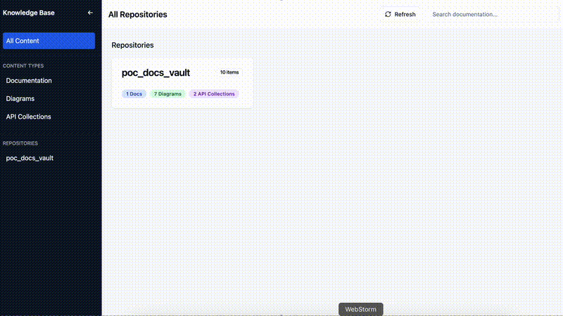

# GitHub Knowledge Vault

A React + TypeScript knowledge base app that aggregates and displays documentation, diagrams, and API collections from GitHub repositories (organization or user).





## Features

- **Repository Overview:** Lists all repositories with a `/doc` folder
- **Content Filtering:** Filter by repository, content type (Markdown, Mermaid, Postman), and search query
- **Content Viewing:** Renders Markdown docs, Mermaid diagrams, and Postman collections
- **Responsive UI:** Collapsible sidebar, filter bar, and content grid
- **Manual Refresh:** Reloads data from GitHub (no caching yet)

## User Flow

1. See a list of repositories with documentation
2. Filter by repository, content type, or search
3. Click a repository or content type to update the content grid
4. Click a content item to open a detailed viewer
5. Refresh data or reset filters at any time

## Supported Repositories

- **Works with:**
  - Any GitHub organization or user (private or public) with repositories containing a `/doc` folder
  - Supported file types in `/doc`:
    - Markdown files (`.md`)
    - Mermaid diagrams (`.mmd`, `.mermaid`)
    - Postman collections (`postman*.json`)
    - SVG pictures (`.svg`)
    - OpenAPI files (`.yml`)
- **Integration:**
  - Only GitHub is supported out of the box
  - No direct integration with other platforms (but code is extensible)

## Setup & Local Development

### Prerequisites
- Python 3.10+
- Node.js 18+
- GitHub personal access token

### Quick Start (Docker)

The easiest way to run all services:

```bash
# Create .env file with your GitHub token
echo "GITHUB_TOKEN=your_github_token_here" > .env
echo "GITHUB_ORGANIZATION=your-org-name" >> .env

# Start all services
docker-compose up
```

Then open http://localhost in your browser.

### Manual Setup (Development)

**1. Start MCP Server:**
```bash
cd ../GitHub_MCP_Server
source venv/bin/activate
python main.py
```

**2. Start MCP Bridge:**
```bash
cd mcp-bridge
source venv/bin/activate
python main.py
```

**3. Start Frontend:**
```bash
bun install
bun run dev
```

**4. Open your browser:**
Navigate to http://localhost:5173

## Environment Variables

### Frontend (.env)
Create a `.env` file in the project root:

```bash
# MCP Bridge Configuration
VITE_MCP_BRIDGE_URL=http://localhost:3001
VITE_GITHUB_ORGANIZATION=your-org-name
```

**No GitHub token needed in frontend!** 🔒

### Backend (Docker Compose .env)
For Docker deployment, create a separate `.env` file:

```bash
GITHUB_TOKEN=your_github_token_here
GITHUB_ORGANIZATION=your-org-name
```

Variables:
- `VITE_MCP_BRIDGE_URL`: MCP Bridge endpoint (default: `http://localhost:3001`)
- `VITE_GITHUB_ORGANIZATION`: GitHub organization or username
- `GITHUB_TOKEN`: GitHub personal access token (backend only)

## Technology Stack

### Frontend
- React 18 + TypeScript
- Tailwind CSS
- shadcn/ui
- React Router
- Lucide React
- Vite
- React Query (TanStack Query)

### Backend
- **MCP Bridge:** FastAPI (Python)
- **MCP Server:** FastMCP (Python)
- Server-side caching (5-minute TTL)

---

**This project is designed to work with any GitHub repository structure as long as documentation assets are placed in a `/doc` folder.**


